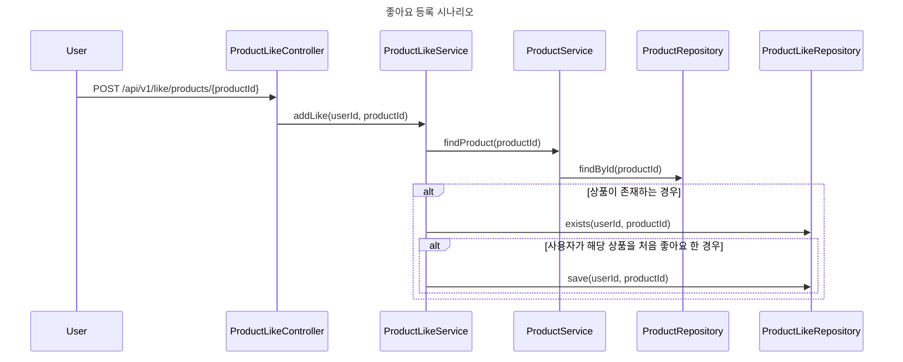
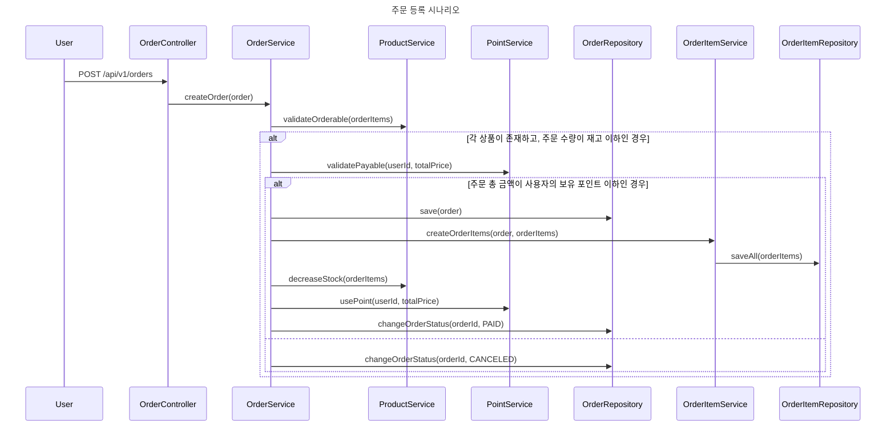

```mermaid
sequenceDiagram
    title 좋아요 등록 시나리오
    participant User
    participant ProductLikeController
    participant ProductLikeService
    participant ProductService
    participant ProductRepository
    participant ProductLikeRepository

    User->>ProductLikeController: POST /api/v1/like/products/{productId}
    ProductLikeController->>ProductLikeService: addLike(userId, productId)
    ProductLikeService->>ProductService: findProduct(productId)
    ProductService->>ProductRepository: findById(productId)

    alt 상품이 존재하는 경우
        ProductLikeService->>ProductLikeRepository: exists(userId, productId)
        
        alt 사용자가 해당 상품을 처음 좋아요 한 경우
            ProductLikeService->>ProductLikeRepository: save(userId, productId)
        end
    end
    
    
```

```mermaid
sequenceDiagram
    title 주문 등록 시나리오
    participant User
    participant OrderController
    participant OrderService
    participant ProductService
    participant PointService
    participant OrderRepository
    participant OrderItemService
    participant OrderItemRepository

    User->>OrderController: POST /api/v1/orders
    OrderController->>OrderService: createOrder(order)
    OrderService->>ProductService: validateOrderable(orderItems)

    alt 각 상품이 존재하고, 주문 수량이 재고 이하인 경우
        OrderService->>PointService: validatePayable(userId, totalPrice)

        alt 주문 총 금액이 사용자의 보유 포인트 이하인 경우
            OrderService->>OrderRepository: save(order)
            
            OrderService->>OrderItemService: createOrderItems(order, orderItems)
            OrderItemService->>OrderItemRepository: saveAll(orderItems)
            
            OrderService->>ProductService: decreaseStock(orderItems)
            OrderService->>PointService: usePoint(userId, totalPrice)
            
            OrderService->>OrderRepository: changeOrderStatus(orderId, PAID)
        else
            OrderService->>OrderRepository: changeOrderStatus(orderId, CANCELED)
        end
    end
```