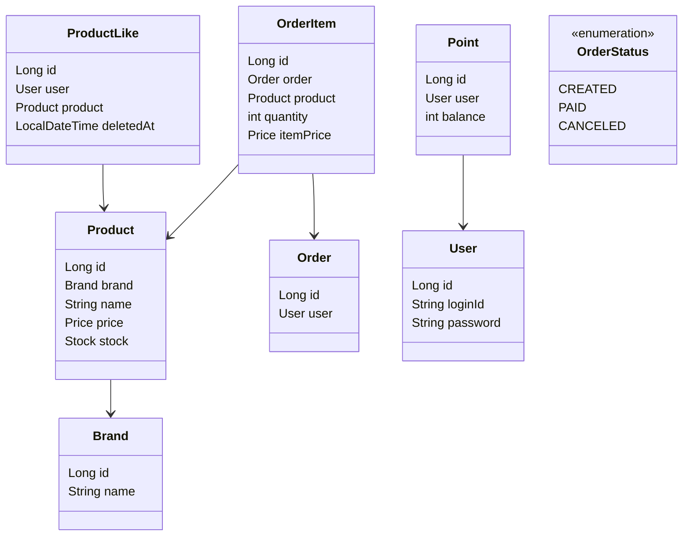

```mermaid
classDiagram
    class Brand {
        Long id
        String name
    }
    class Product {
        Long id
        Brand brand
        String name
        Price price
        Stock stock
    }
    class ProductLike {
        Long id
        User user
        Product product
        LocalDateTime deletedAt
    }
    class User {
        Long id
        String loginId
        String password
    }
    class Point {
        Long id
        User user
        int balance
    }
    class Order {
        Long id
        User user
    }
    class OrderItem {
        Long id
        Order order
        Product product
        int quantity
        Price itemPrice
    }
    
    class OrderStatus {
        <<enumeration>>
        CREATED
        PAID
        CANCELED
    }

    Product --> Brand
    ProductLike --> Product
    Point --> User
    OrderItem --> Order
    OrderItem --> Product
```