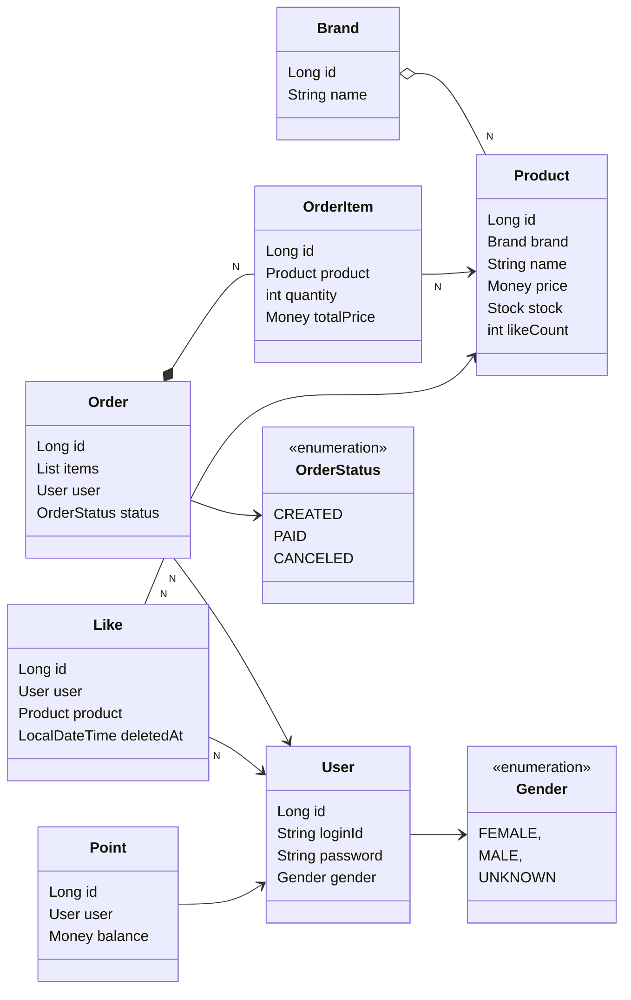

```mermaid
classDiagram
    direction LR
    class Order {
	    Long id
        List<OrderItem> items
	    User user
	    OrderStatus status
    }
    class OrderItem {
	    Long id
	    Product product
	    int quantity
	    Money totalPrice
    }

    class Point {
	    Long id
	    User user
	    Money balance
    }

    class Like {
	    Long id
	    User user
	    Product product
	    LocalDateTime deletedAt
    }

    class User {
	    Long id
	    String loginId
	    String password
        Gender gender
    }


    class Product {
	    Long id
	    Brand brand
	    String name
	    Money price
	    Stock stock
	    int likeCount
    }

    class Brand {
	    Long id
	    String name
    }


    class Gender {
        <<enumeration>>
        FEMALE,
        MALE,
        UNKNOWN
    }
    class OrderStatus {
        <<enumeration>>
	    CREATED
	    PAID
	    CANCELED
    }


    Point --> User
    Like "N" --> User
    User --> Gender
    Like "N" --> Product
    Order *-- "N" OrderItem
    OrderItem "N" --> Product
    Order "N" --> User
    Order --> OrderStatus
    Brand o-- "N" Product
    
    
```