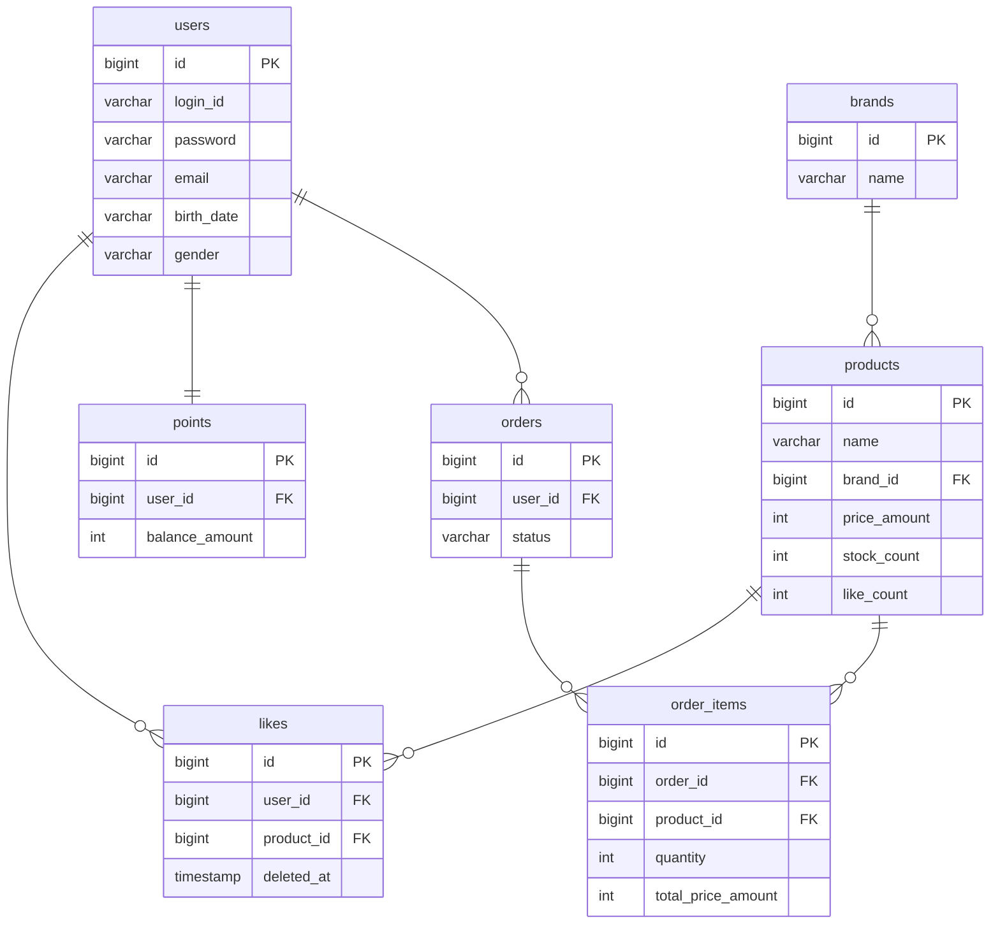

```mermaid
erDiagram
%% created_at, updated_at 등 공통 컬럼은 모든 테이블에 포함되어 있습니다
brands {
    bigint id PK
    varchar name
}
products {
    bigint id PK
    varchar name
    bigint brand_id FK
    int price_amount
    int stock_count
    int like_count
}
likes {
    bigint id PK
    bigint user_id FK
    bigint product_id FK
    timestamp deleted_at
}
users {
    bigint id PK
    varchar login_id
    varchar password
    varchar email
    varchar birth_date
    varchar gender
}
points {
    bigint id PK
    bigint user_id FK 
    int balance_amount
}
orders {
    bigint id PK
    bigint user_id FK
    varchar status
}
order_items {
    bigint id PK
    bigint order_id FK
    bigint product_id FK
    int quantity
    int total_price_amount
}

brands ||--o{ products : ""
users ||--o{ likes : ""
users ||--|| points : ""
users ||--o{ orders : ""
orders ||--o{ order_items : ""
products ||--o{ likes : ""
products ||--o{ order_items : ""

```